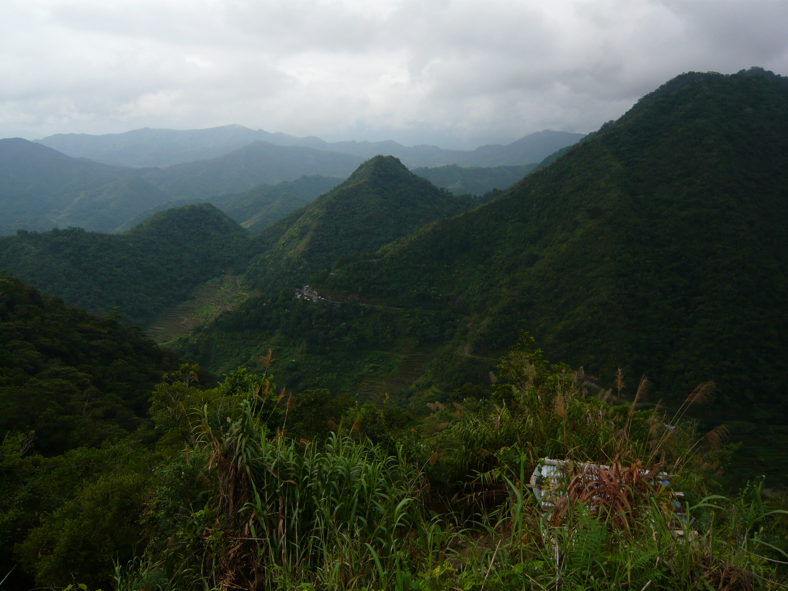
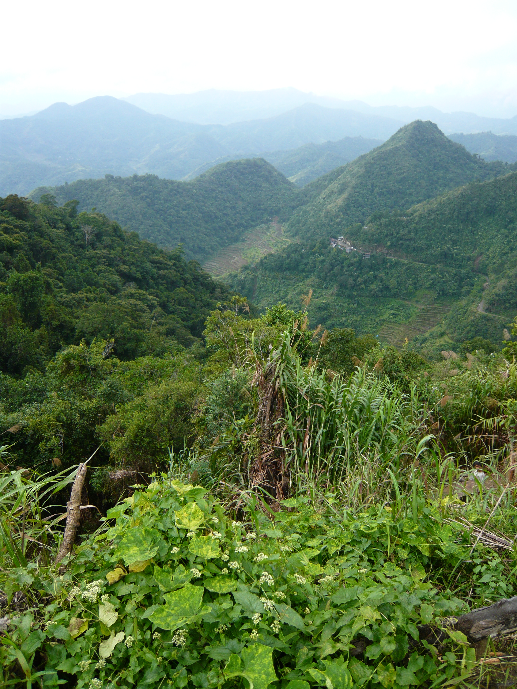
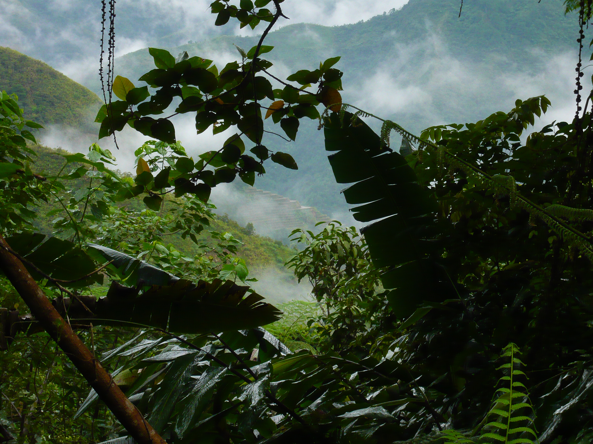
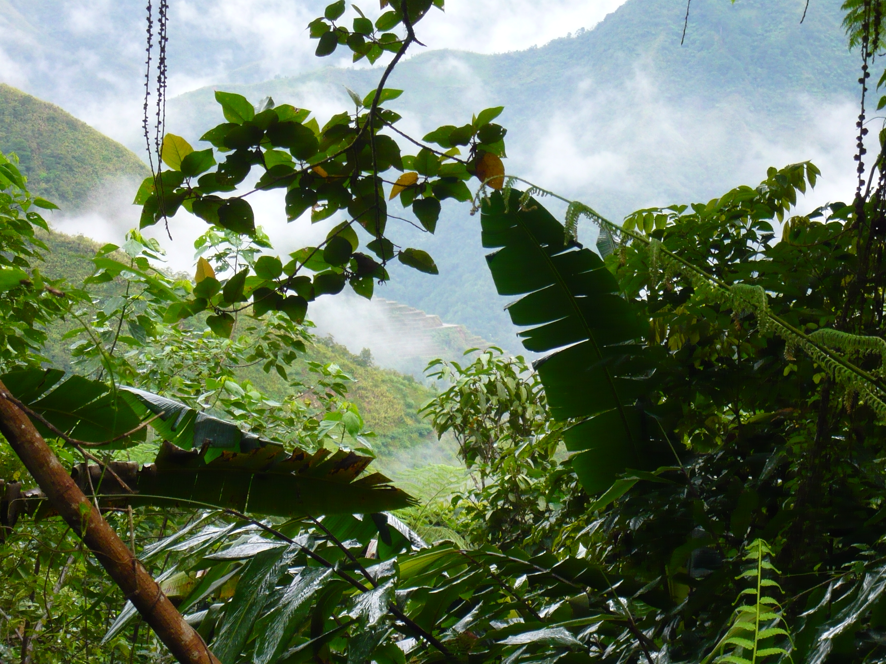
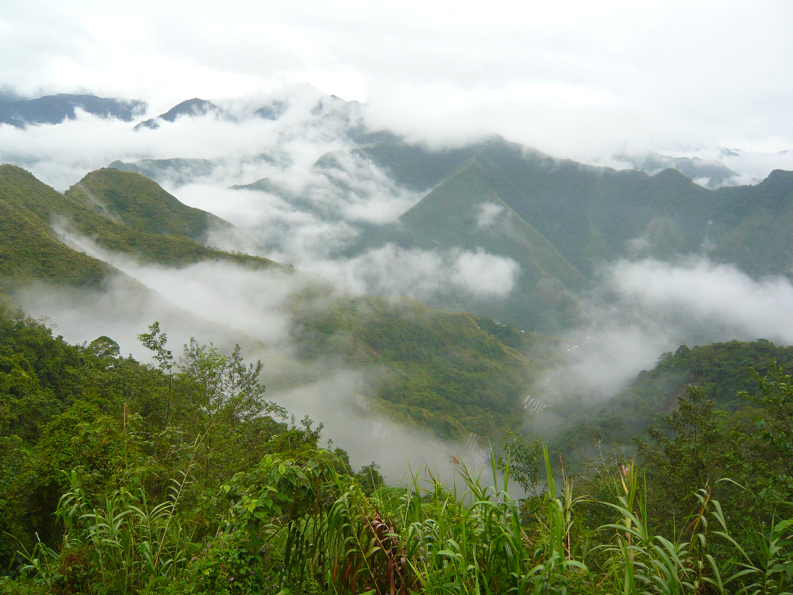
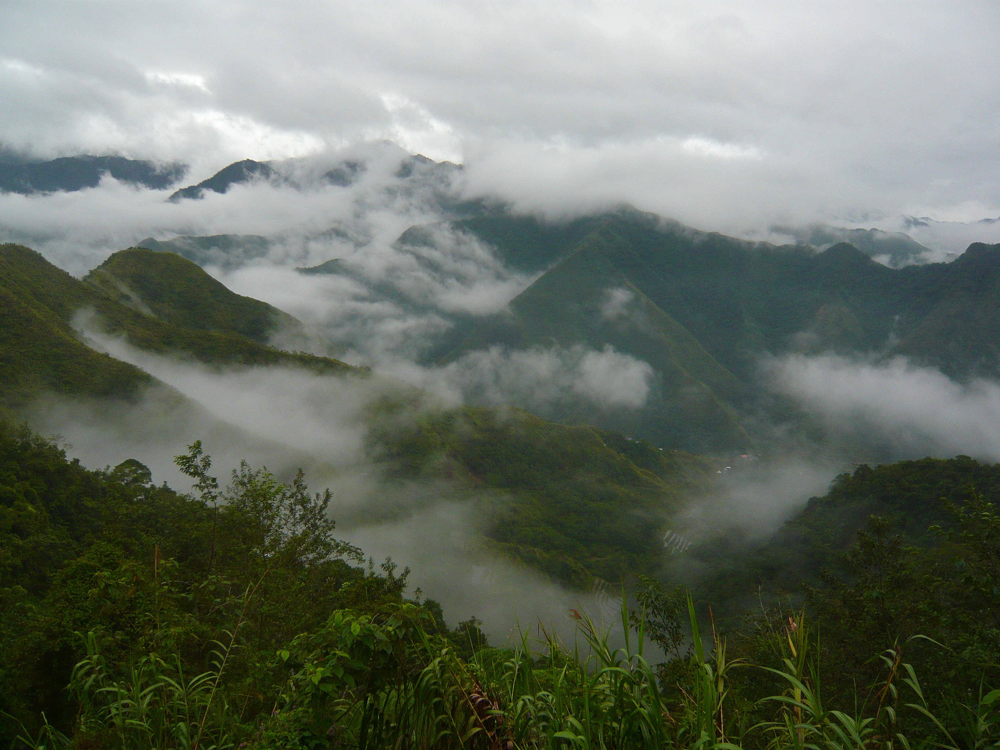
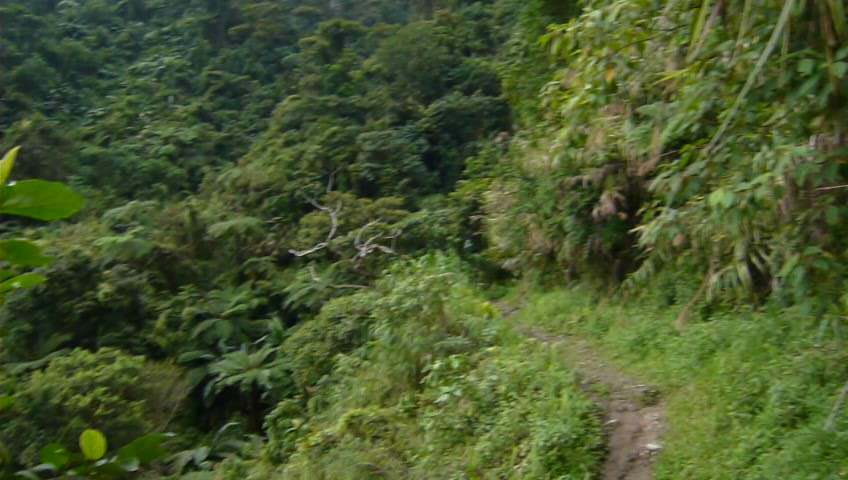

# Project: Image Retrieval

NOTE: unzip the image directories and the trained data directory before running

## Description
The goal of this project is to build a system to retrieve near duplicate images.
There is several parts to this project and the main library used is OpenCV in python.
The first part is to retrieve similar images with feature matching.
The second part is to retrieve similar images with Bag-of-Visual Words method.


### Retrieval with feature matching
The relevant files for this part is:
```
|- Task1_Exploration.ipynb
|- OpenCV_Feature_Matching.ipynb
|- OpenCV_Feature_Matching.py
```
`Task1_Exploration.ipynb` explores the library OpenCV, ranging from descriptor retrieval
methods such as SIFT and SURF, geometric transformations such as rotation, scaling, etc and
feature matching methods with BruteForce(BFMatcher), Nearest Neighbour (kNNMatcher) and
Flann-based matcher.

`OpenCV_Feature_Matching.ipynb` is a visual notebook that performs the task of retrieving
the most similar images (returning the ids of the images) by feeding in a query image and
providing a directory of images to retrieve the similar images.
The method is as follows:
1. For the query image, retrieve the image descriptors
2. For each image in the image directory: retrieve the image descriptors, compute the feature matching with nnMatch and filter the best matches according to a ratio of 0.7. 
3. The similarity of each image is computed as a percentage of descriptors in good matches against the total number of descriptors i.e. `len(good)/len(total) `
4. All the similarity scores are stored and then sorted. The most similar ones are being returned.

`OpenCV_Feature_Matching.py` is a python file that can be run as followed
```
python OpenCV_Feature_Matching.py --query_image="<imagepath>" --image_dir="<imagedir>" --top_n=<optionalvalue>
```
- query_image -- path to the image to be queried
- image_dir -- path to the image directory to retrieve
- top_n -- (optional) default is 5

This python file performs the same task as `OpenCV_Feature_Matching.ipynb`

### Retrieval with Bag-of-Visual-Words
The relevant files for this part is:
```
|- BOVW_notebook.ipynb
|- bvow.py
|- retrieve_bovw.py
|- 1548788884.zip
```

`BOVW_notebook.ipynb` is a visual notebook that performs the task of retrieving the most similar
images with Bag-of-Visual-Word method. It generates an index for each image to ease the retrieval.
The method is as followed:
- For each image, generate the image descriptors with either SIFT/SURF.
- Generate k clusters for the image descriptors, each descriptor is assigned to one cluster.
- For each image, generate the "vocabulary" representation, which is given by the frequency of the clusters of its descriptors
- Perform TFIDF:
  - Generate the IDF dictionary. IDF = log(total no. of docs / number of docs which has word j)
  - For each image calculate the TFIDF where, TF = Number of occurences of word j in document d / Number of words in document d and TFIDF= TF * IDF
- Generate inverted index for each vocabulary(cluster) to speed up the search.

In order to retrieve the similar images:
- Generate the descriptor for the query image
- Retrieve the cluster representations for the image
- For each cluster, retrieve the list of potential image matches by retrieving it from the inverted index, this shoudl reduce the number of images to process in the case where there are millions of images
- For each image in the inverted index, compute the similarity score of the query image against it and store it
- Sort the scores and return the most similar images

`bvow.py` is the python file that performs the generation of the relevant data for the task. It is equivalent to the first part of the notebook.  To run it:
```
python bvow.py --path=<dir of images> --n_clusters=<number of clusters> --nfeatures=<optional>
```
- path -- path to the image to be trained on
- n_clusters -- number of clusters for the kmeans clustering for vocabularies
- n_features -- (optional) default is 1000. Number of descriptors to be generated for each image

This task outputs the relevant trained data into a dir, one such directory is `1548788884.zip`.
It is required for the retrival task in `retrieve_bovw.py`

`retrieve_bovw.py` is the python file to retrieve the similar images.
To run it, you require a trained data folder.
```
python retrieve_bovw.py --pretrained_path=<dir of trained data> --image=<id of the image> --top_n=<optional>
```
- pretrained_path -- path trained data, unzip 1548788884.zip to test it.
- image -- id of the image to be retrieved for, example "100000.jpg"
- top_n -- (optional) default is 5. The id of the similar images.

### Retrieval with Deep Learning data using trained VGG16 on ImageNet
NOTE: the following method are referenced from the implementation of RMAC from https://github.com/noagarcia/keras_rmac  
The relevant files are:
```
|- deep_learning_representation.ipynb
|- deep_learning_representation.py
|- deeplearning_1549050121.zip
```
`deep_learning_representation.ipynb` is a visual notebook that performs the task of retrieving the most similar
images with trained VGG16 model on ImageNet with a Region-of-Interest pooling layer.

The features are generated with:
- VGG16 pretrained model on ImageNet layer
- RoiPooling layer - returns an output of (1, sizeofROI, 512)
```
@article{DBLP:journals/corr/HeZR014,
  author    = {Kaiming He and
               Xiangyu Zhang and
               Shaoqing Ren and
               Jian Sun},
  title     = {Spatial Pyramid Pooling in Deep Convolutional Networks for Visual
               Recognition},
  journal   = {CoRR},
  volume    = {abs/1406.4729},
  year      = {2014},
  url       = {http://arxiv.org/abs/1406.4729},
  archivePrefix = {arXiv},
  eprint    = {1406.4729},
  timestamp = {Mon, 13 Aug 2018 16:49:00 +0200},
  biburl    = {https://dblp.org/rec/bib/journals/corr/HeZR014},
  bibsource = {dblp computer science bibliography, https://dblp.org}
}
```
- Sum of the features of each ROI - returns an output of (1, 1, 512)


`deep_learning_representation.py` is the python file that performs the generation of the relevant data for the task. It is equivalent to the first part of the notebook.
To run training:
```
python deep_learning_representation.py --image_dir="images/"
```
- images_dir -- path to the directory image to be trained on
The trained vectors are output to a directory prefixed with `deeplearning_{timestamp}`

To retrieve image from the database:
If there is trained vectors:
```
python deep_learning_representation.py --mode="retrieve" --query_image=<path> --trained_path=<dir_path>
```
- mode -- set mode to retrieve if it is to retrieve similar images, train(default)/retrieve
- query-image -- path to the image to query
- trained_path -- path to the directory of the trained data , unzip deeplearning_1549050121.zip to use and pass `deeplearning_1549050121` as the dir_path

If there is no trained vector
```
python deep_learning_representation.py --mode="retrieve" --query_image=<path> --image_dir=<dir_path>
```
- mode -- set mode to retrieve if it is to retrieve similar images, train(default)/retrieve
- query-image -- path to the image to query
- image_dir -- path to the directory of images to be trained, output will be dumped to a directory with prefix deeplearning_*


## Results
These are the results from performing the image retrieval with the different methods and default values defined in the codes.
The image retrieval is performed on Image 100002.jpg
Feature Matching = ['100002.jpg', '100001.jpg', '100000.jpg', '100101.jpg', '100100.jpg']<br>
<br>
'100002.jpg'<br>
<br>
'100001.jpg'<br>
<br>
'100000.jpg'<br>
<br>
'100101.jpg'<br>
<br>
'100100.jpg'<br>

BOW = ['100002.jpg', '107902.jpg', '100503.jpg', '107901.jpg', '100501.jpg']<br>
<br>
'100002.jpg'<br>
<br>
'107902.jpg'<br>
<br>
'100503.jpg'<br>
<br>
'107901.jpg'<br>
<br>
'100501.jpg'<br>
                                                      
                                                      
DeepLearning = ['100002.jpg', '100501.jpg', '100503.jpg', '100401.jpg', '100000.jpg']<br>
<br>
'100002.jpg'<br>
<br>
'100501.jpg'<br>
<br>
'100503.jpg'<br>
<br>
'100401.jpg'<br>
<br>
'100000.jpg'<br>

## Requirements
- The machine of which all these explorations are performed on is MacOS
- The list of required libraries are listed in `environment.yml`
- Installation of ``Anaconda`` can be performed by running `./setup_conda.sh`
- The environment to run these codes can be generated by running `./setup_env.sh`
- Perform `source activate image_retrieval` whenever the code is to be run
- Install redis for your local computer. For MacOS perform `brew install redis` followed by `brew services start redis` to start the server
